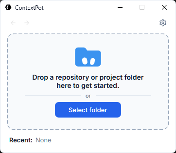
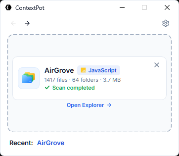
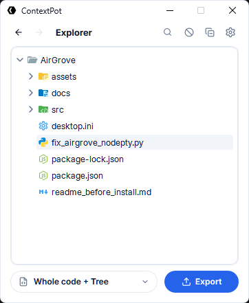
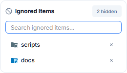
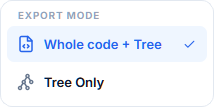
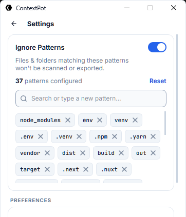

<div align="center">


# ContextPot

**A local-first project explorer and AI-ready Markdown context exporter.**

Turn any codebase into a clean, structured hierarchy — then export LLM-ready Markdown (`.md`) context with syntax-highlighted code blocks, visual tree diagrams, and automatic secret redaction.

[](https://microsoft.com/windows)
[](https://www.python.org/)
[](https://www.qt.io/)
[](https://github.com/abdulkarim20-ui/ContextPot)
[](LICENSE)

*Windows 10/11 · Python 3.10+ · PySide6 · 100% Offline & Private*

</div>

---

## 💡 Overview

When working with modern LLMs (Claude, ChatGPT, Gemini, DeepSeek) or conducting code reviews, providing the right context is critical:

- Raw zip files cannot be pasted into chat windows.
- Manually copying files one-by-one is tedious and loses project structure.
- Build artifacts (`node_modules`, `dist`, `__pycache__`) waste precious context window tokens.
- Unintentional API keys, tokens, and passwords risk accidental exposure.

**ContextPot solves this locally and instantly.** Drag and drop any repository to inspect its structure, exclude unwanted folders or files, and generate optimized Markdown (`.md`) files tailored for AI prompts and architectural reviews.

---

## ✨ Key Features

### 1. 🏠 Minimalist Drag & Drop Launcher
- **Instant Project Load**: Drag any folder directly from Windows Explorer into the interactive drop zone.
- **Project Identity Detection**: Linguist-style byte-weighted code analysis identifies the dominant language and framework (Python, TypeScript, React, Rust, Go, Java, etc.) with dynamic badge chips and intelligent text elision.
- **Recent Projects Bar**: One-click re-access to previously loaded repositories with automatic path validation.

<p align="center">
  
</p>

<p align="center">
  
</p>

---

### 2. 🌲 Interactive Tree with Material Theme Icons
- **370+ Material Theme Icons**: Distinct SVG icons for files and folders (e.g. Node, React, Python, Git, Docker, tests).
- **Non-Blocking Incremental Population**: Batched rendering ensures the interface stays fluid even on codebases with thousands of files.
- **Expanded State Memory**: Remembers your expanded folder states across re-scans and saves.
- **Collapse & Expand All**: Single-click toolbar actions for fast navigation.

<p align="center">
  
</p>

---

### 3. 🔍 Real-Time Search & Match Highlighting
- **Instant Filtering**: Search through the entire project tree as you type.
- **Visual Badging**: Matches are highlighted with clean amber indicator badges.
- **Auto-Expansion**: Collapsed folders containing matching files automatically expand to reveal results.

---

### 4. 🚫 3-Tier Ignore Engine & Session Exclusions
- **Built-in Defaults**: Automatically filters 18+ noisy build and dependency directories (`node_modules/`, `.git/`, `dist/`, `build/`, `__pycache__/`, `.venv/`, `.next/`).
- **Persistent User Rules**: Add custom glob patterns (`*.log`, `*.tmp`, `coverage/`) in the Settings view.
- **Session Exclude**: Right-click any file or folder in the tree to temporarily exclude it from the export.
- **Ignored Items Popup**: View, search, and restore excluded items with matching Material Theme icons directly from the toolbar.

<p align="center">
  
</p>

---

### 5. 📄 LLM-Ready Markdown (`.md`) Exporter
Export clean, structured Markdown files formatted specifically for Large Language Models:

| Export Mode | Output File | Contents & Use Case |
| :--- | :--- | :--- |
| **Whole code + Tree** | `{Project}_full.md` | **Full AI Prompts**: Complete directory hierarchy diagram + syntax-highlighted code blocks for all included files. |
| **Tree Only** | `{Project}_tree.md` | **Architectural Reviews**: Lightweight directory outline without source code bodies. |
| **Selected Subtree** | `{Project}_selected_full.md` | **Scoped Context**: Export only selected files or subfolders from the right-click menu. |

<p align="center">
  
</p>

- **Syntax-Highlighted Code Blocks**: Automatically infers code block language tags (`python`, `typescript`, `jsx`, `json`, `rust`, etc.).
- **Automatic Secret Redaction**: Identifies API keys, tokens, and passwords in source files and masks them with `/* REDACTED SENSITIVE VALUE */`.
- **Binary File Sniffing**: Automatically excludes binary files (images, audio, executables) with a clean annotation.
- **Smart Destination Memory**: Remembers export paths per repository for quick repeat exports.

---

### 6. 👁️ Live Background Filesystem Watcher
- **Threaded Worker**: Monitored on a background `QThread` with zero GUI freezes.
- **Intelligent Debounce**: Coalesces bursts of file saves, branch checkouts, or build output into a single refresh.
- **Structure Hash Verification**: Content edits do not trigger unnecessary tree rebuilds, keeping browsing responsive.

---

## 📑 Sample Markdown Export Output

When exporting in **Whole code + Tree** mode, ContextPot generates a clean, single `.md` file structured as follows:

````markdown
# my-app
> Generated by ContextPot

## Project Information
- **Project:** `my-app`
- **Root:** `C:\Projects\my-app`
- **Export format:** Markdown
- **Purpose:** LLM-ready project context

```text
📁 my-app/
├── 📁 src/
│   ├── 📄 app.tsx
│   └── 📄 index.css
├── 📄 package.json
└── 📄 README.md
```

## Code & File Contents

### src/app.tsx

```tsx
import React from "react";

export function App() {
  return <h1>Hello from ContextPot</h1>;
}
```

### package.json

```json
{
  "name": "my-app",
  "version": "1.0.0"
}
```
````

---

## 🚀 Quick Start

### Prerequisites
- **Windows 10** or **Windows 11**
- **Python 3.10** or newer

### Installation

```bash
# Clone the repository
git clone https://github.com/abdulkarim20-ui/ContextPot.git
cd ContextPot

# Create and activate virtual environment
python -m venv .venv
.\.venv\Scripts\activate

# Install dependencies
pip install -r requirements.txt
```

### Run Application

```bash
python main.py
```

### Run Tests

```bash
pytest
```

---

## ⚙️ Settings & Customization

The Settings view allows you to configure persistent ignore patterns and workflow options:

- **Custom Ignore Rules**: Add patterns (e.g. `*.bak`, `temp_*`, `output/`) with instant tag removal.
- **Workflow Preferences**: Toggle auto-scan on drop, remember export directories, and reset defaults at any time.

<p align="center">
  
</p>

---

## 🛡️ Privacy & Security

- **100% Offline**: All scanning, tree building, and export formatting run entirely on your local machine. No code or metadata is ever transmitted to the internet.
- **Built-in Secret Masking**: Proactively redacts common credential signatures (`api_key`, `token`, `secret`, `private_key`, `password`) before exporting.
- **Human Verification**: Secret redaction is a safety aid; developers should always review exported context before sharing externally.

---

## 📜 Credits & License

- **File & Folder Icons**: SVG assets derived from the [Material Icon Theme](https://github.com/material-extensions/vscode-material-icon-theme) (MIT License).
- **GUI Framework**: Built with [PySide6 (Qt for Python)](https://www.qt.io/).
- **Typography**: Inter (UI text) and JetBrains Mono (code and paths).

Distributed under the terms specified in the [LICENSE](LICENSE) file.  
Copyright &copy; 2026 **AbdulKarim**. All rights reserved.

<div align="center">

---

**ContextPot** · *Understand your codebase. Control your context. Export clean Markdown.*

</div>
